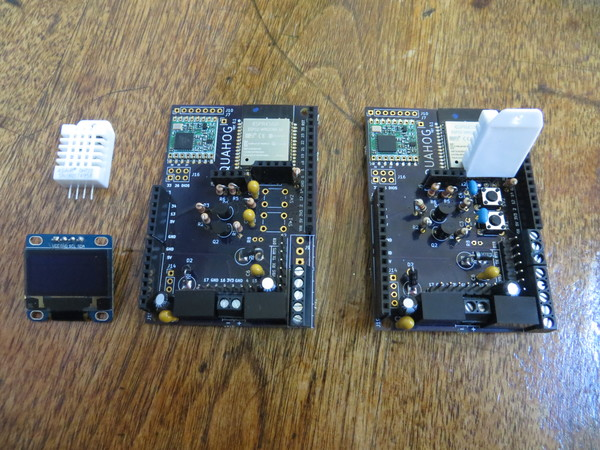
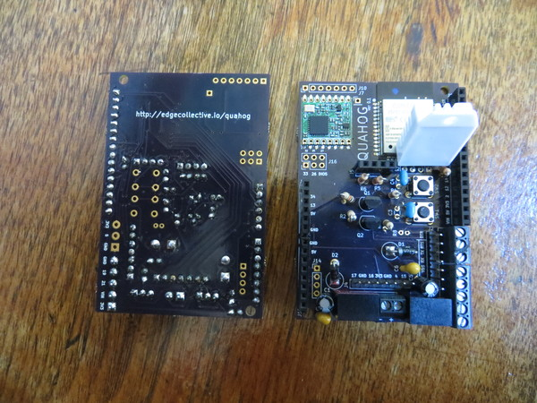

# Posting to FarmOS







```python
import ujson as json
import urequests as requests
import time
import dht
import machine
from machine import Pin
from machine import SPI
import ssd1306
from machine import I2C

# set up the display
i2c = I2C(-1, Pin(14), Pin(2))
oled = ssd1306.SSD1306_I2C(128, 64, i2c)

# set up the 'done' pin
done_pin=Pin(22,Pin.OUT)
done_pin.value(0)

# indicate that we're starting up
oled.fill(0)
oled.text("Starting up ...",0,0)
oled.show()

# set up the DHT22 temp + humidity sensor
d = dht.DHT22(machine.Pin(18))

# set up FARMOS params
base_url='https://wolfesneck.farmos.net/farm/sensor/listener/'
public_key='xxxx'
private_key='xxxx'
url = base_url+public_key+'?private_key='+private_key
headers = {'Content-type':'application/json', 'Accept':'application/json'}

WIFI_NET = 'xxxx'
WIFI_PASSWORD = 'xxxx'

# function for posting data
def post_data():
    try:
    	r = requests.post(url,data=json.dumps(payload),headers=headers)
    except Exception as e:
	print(e)
	#r.close()
	return "timeout"
    else:
	r.close()
	print('Status', r.status_code)
   	return "posted"

# function for connecting to wifi
def do_connect():
    import network
    sta_if = network.WLAN(network.STA_IF)	
    if not sta_if.isconnected():
        print('connecting to network...')
	sta_if.active(False)
        sta_if.active(True)
        sta_if.connect(WIFI_NET, WIFI_PASSWORD)
        while not sta_if.isconnected():
            pass
    print('network config:', sta_if.ifconfig())

index=0

# main loop
while True:

	# make measurements
	d.measure()
	t=d.temperature()
	h=d.humidity()
	adc = machine.ADC(machine.Pin(35))
	adc_val=adc.read()

	# form the payload
	payload ={"temp": t,"humidity":h,"adc_val":adc_val}
	print(payload)

	# connect to network
	oled.fill(0)
	oled.text("Connecting "+str(index),0,20)
	oled.show()
	do_connect()

	# post the data
	oled.text("Posting...",0,30)
	oled.show()
	post_data()
	oled.text("Posted.",0,40)
	oled.show()

	# indicate sleeping
	oled.text("Sleeping...",0,50)
	oled.show()
	
	# pull the "DONE" pin to sleep
	done_pin.value(1)

	index+=1

	time.sleep(5)
```

# East Boston Salvadoran Corn Festival


# Flood Sensor


# One-wire sensors


# SD Card


# Satellite Modem


# Baked Quahog


# Milling a PCB


