<head>
	
	</head>

# Low-power Sensor --> LoRa/Wifi Gateway --> FarmOS

## Hardware Setup

We're using a battery-powered [Adafruit Feather](https://www.adafruit.com/product/3178) microcontroller as as a remote instrument to measure temperature, light, and its own battery level.  For sensors, we're using a [DS18B20 'onewire' probe](https://www.amazon.com/T-PRO-DS18b20-Waterproof-Temperature-Transmitter/dp/B073XKXB3G/ref=asc_df_B073XKXB3G/?tag=hyprod-20&linkCode=df0&hvadid=216574878909&hvpos=1o2&hvnetw=g&hvrand=7307361722931237624&hvpone=&hvptwo=&hvqmt=&hvdev=c&hvdvcmdl=&hvlocint=&hvlocphy=9002000&hvtargid=pla-350075920462&psc=1) to measure temperature, and a simple [light-dependent resistor](https://www.amazon.com/Honbay-Photoresistor-Dependent-Resistor-Sensitive/dp/B07DHDQ8LN/ref=asc_df_B07DHDQ8LN/?tag=hyprod-20&linkCode=df0&hvadid=241964169520&hvpos=1o2&hvnetw=g&hvrand=11525597541767094435&hvpone=&hvptwo=&hvqmt=&hvdev=c&hvdvcmdl=&hvlocint=&hvlocphy=9002000&hvtargid=pla-499448294844&psc=1) to measure light level. 

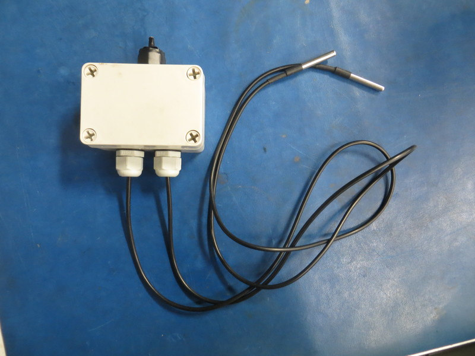
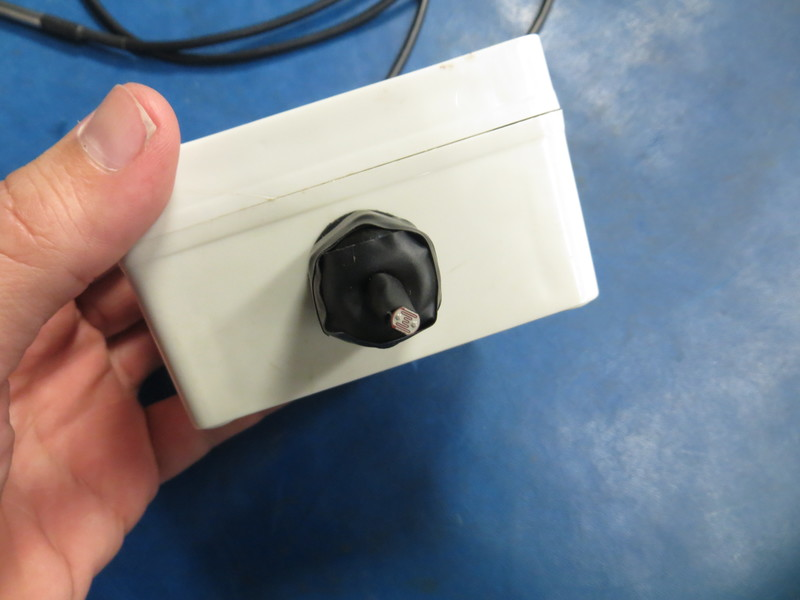
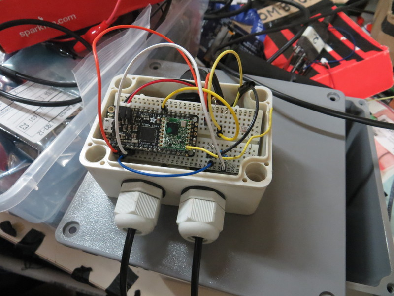
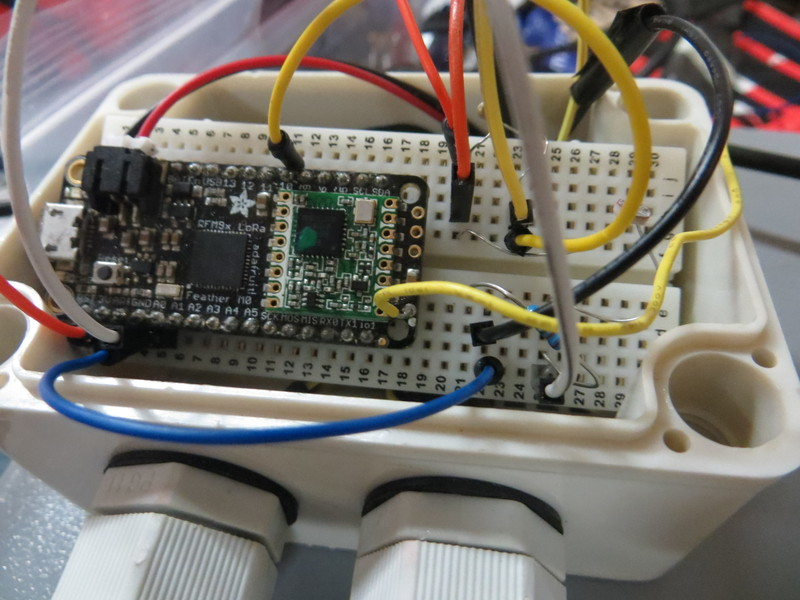
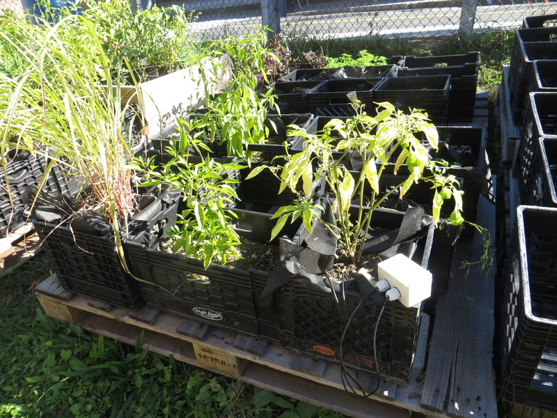
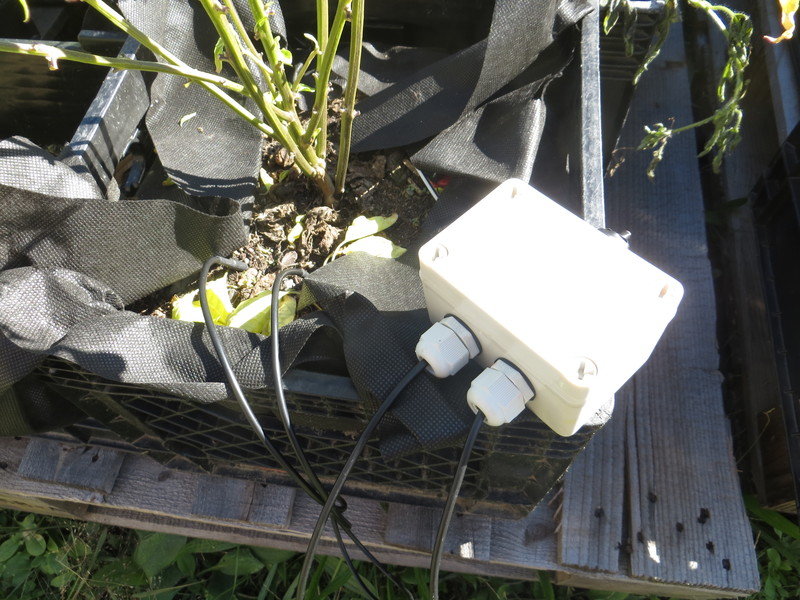
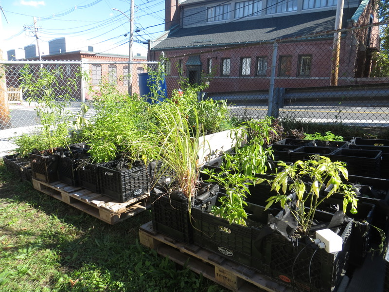

This remote sensor periodically sends these measurements via LoRa radio to a [Quahog](quahog.html) microcontroller --  which in this setup is acting as a LoRa/wifi gateway, receiving messages from the Feather via LoRa, and posting them online via wifi.
 
 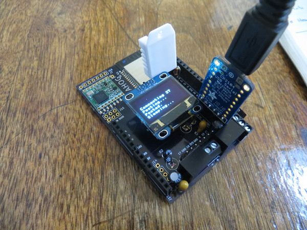
 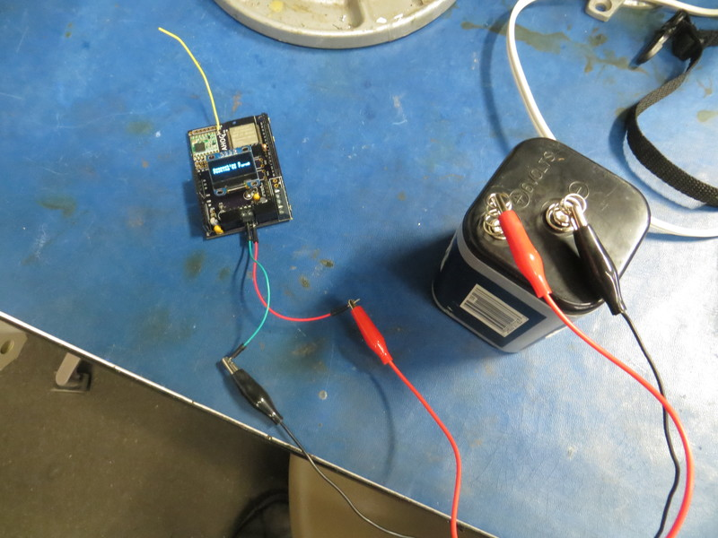

## Storing Data

The Quahog can store data locally to an SD card; in the current setup, the Quahog is posting the measurements it receives from the remote sensor (via LoRa) to 'cloud-based' servers (via wifi) -- both to [FarmOS](https://wolfesneck.farmos.net/farm/sensor/quahog001) and to [ThingSpeak.com](thingspeak.com) (at [Feed ID= 607062](https://thingspeak.com/channels/607062)). 

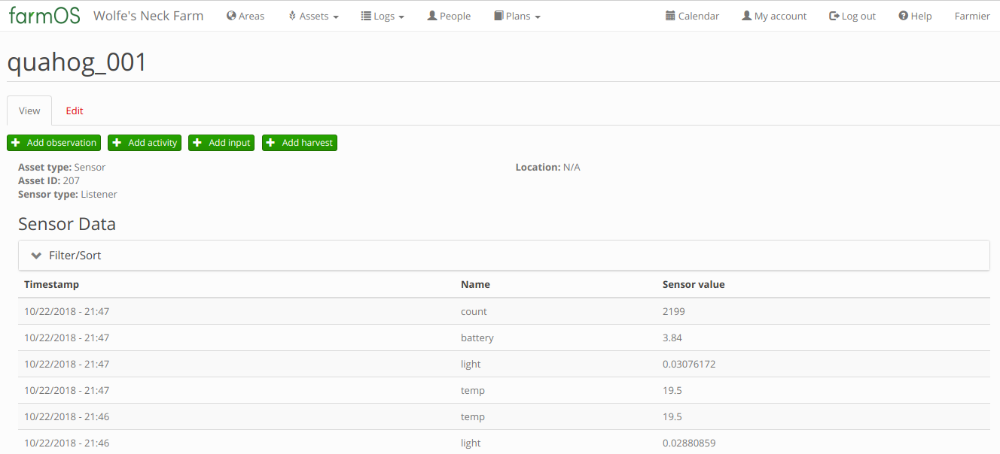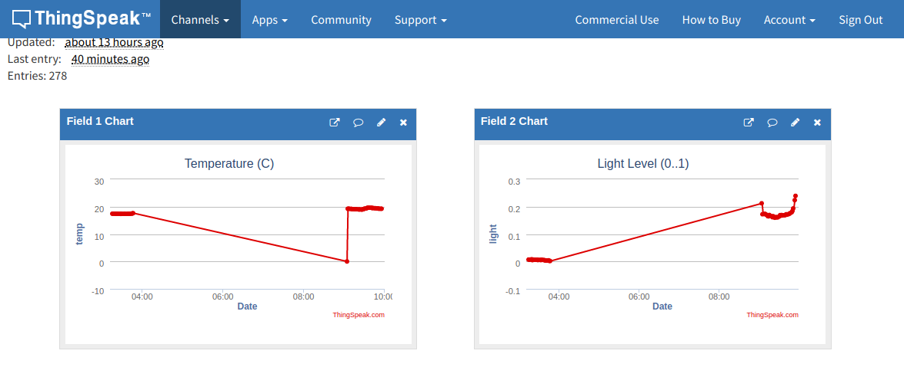

## Live Plots

The graphs below are plotted using the [Plotly.js](https://github.com/plotly/plotly.js) library.  Currently, the data is being pulled from ThingSpeak's data API.  To fetch the most recent 10 datapoints from ThingSpeak's feed id=607062, one can use a 'GET' request of the form:

[https://api.thingspeak.com/channels/607062/feeds.json?results=10](https://api.thingspeak.com/channels/607062/feeds.json?results=10)

Plots are updated every 60 seconds (when feed is 'live').

<table style="table-layout:fixed; width:1200px">
  <tr>
    <td id="temp" style="width:33%;height:300px;"></td>
    <td id="light" style="width:33%;height:300px;"></td>
    <td id="batt" style="width:33%;height:300px;"></td>
  </tr>
</table>

## Misc Notes

References for enabling 'timeouts' in Micropython HTTP POST functions (TODO):

- Requests library for esp32 Micropython doesn't have 'timeout' functionality: [https://github.com/micropython/micropython-lib/pull/263](https://github.com/micropython/micropython-lib/pull/263)
- Issues with using uselect.poll() methods: [https://github.com/micropython/micropython/issues/3963](https://github.com/micropython/micropython/issues/3963)
- Using error messages to assess the status of socket connections: [https://github.com/micropython/micropython-esp32/issues/166](https://github.com/micropython/micropython-esp32/issues/166)

